# Deployment

## Steps

To deploy the application to your tenancy, follow these steps:

1. Go to [Oracle Stacks](https://cloud.oracle.com/resourcemanager/stacks/):

   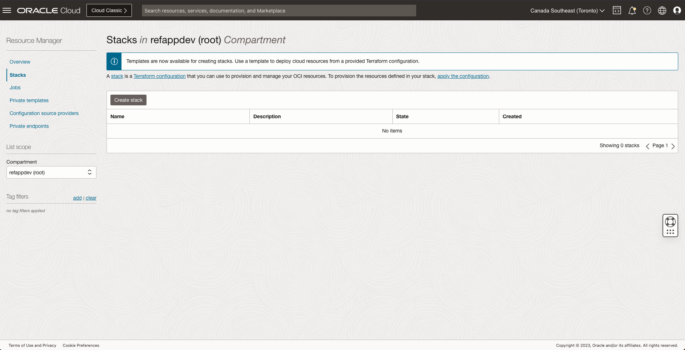

1. Create a new stack:

   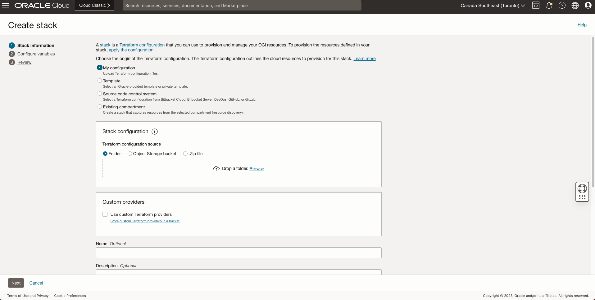

1. Zip the `src` and `deploy` directory of the repository and upload it to the **Stack configuration** section.

1. Choose a **name** and **description**.

1. Select **Terraform version** as `1.2.x`

1. Add the configuration variables.

   - The Oracle Identity Cloud Service `(IDCS) URL` (For example, https://idcs-xxxx.identity.oraclecloud.com), `Client ID`, and `Client Secret` are generated during the IDCS configuration. For more information,
     see IDCS section in the
     [prerequisites and configurations](prereq-config.md)
     topic.
   - Select the option to create a vault or provide an existing vault and
     the encryption key if available. For more information, see [managing vaults](https://docs.oracle.com/en-us/iaas/Content/KeyManagement/Tasks/managingvaults.htm).

     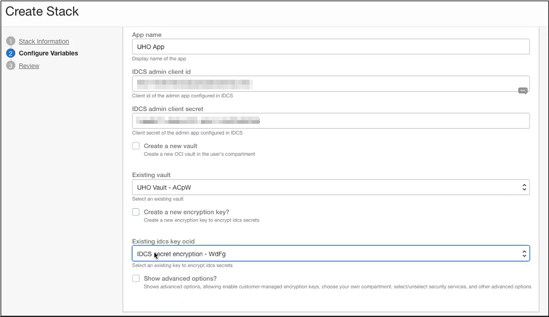

1. Enter the SMTP `username` and `password`.

   - To generate new SMTP credentials, go to **User Settings** from the user menu.

     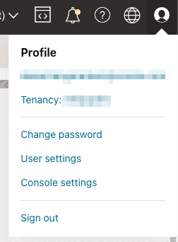

   - Click **Generate SMTP Credentials**. Copy the generated username and the password.

     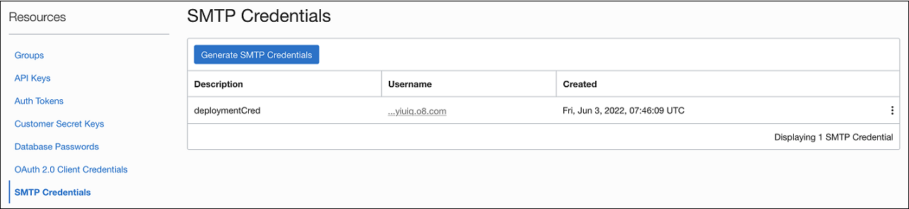

1. Enter the `Auth Token`.

   - To generate a new token, go to `User Settings` from the user menu.

   - Click **Generate Token**. Copy the generated auth token.

     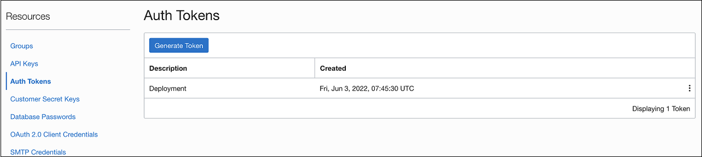

1. In addition to these steps, you can configure the following advanced options:

   - Select **Creation of DevOps project**. For configuration details, see [Deployment through DevOps](devops-deployment.md).
   - Provide custom encryption keys for OKE cluster.
   - Enable Cloud Guard, and Web Application Firewall (WAF).

   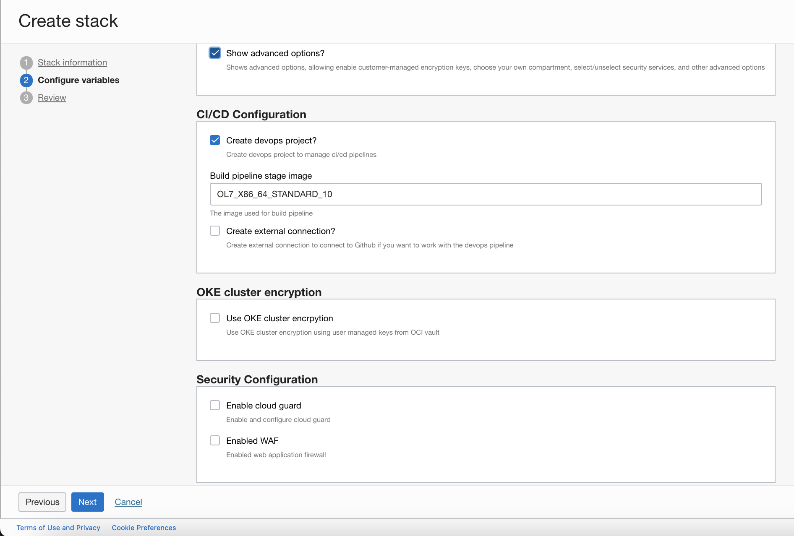

   > **Note**: To enable Cloud Guard, select the appropriate reporting region. If Cloud Guard is already enabled in your tenancy, you must provide the reporting region specified in CloudGuard > Settings.
   > To know more about selecting a Cloud Guard reporting region, see
   > [Enabling Cloud Guard](https://docs.oracle.com/en-us/iaas/cloud-guard/using/part-start.htm#cg-access-enable-steps).

1. Review the configurations and click **Create**.

   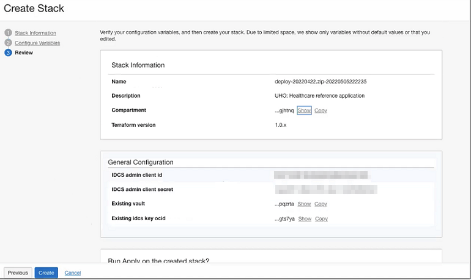

   A job is created and applied automatically. This job provisions the OCI resources and deploys the services to the OKE cluster.

   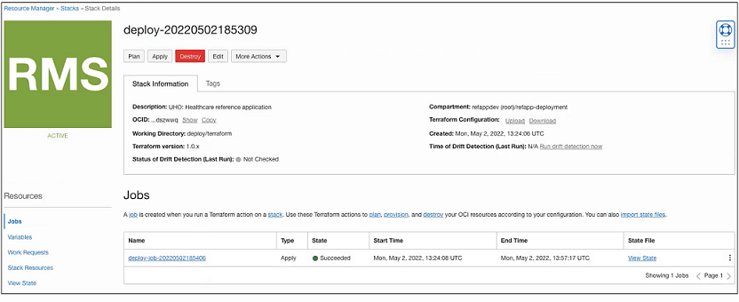

1. Select the job and click **Outputs**.

   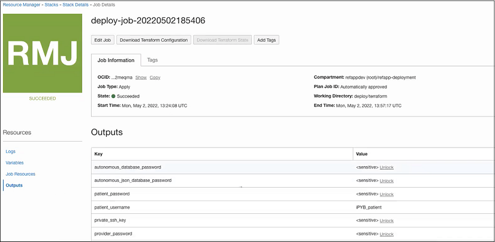

   The Outputs table shows the `patient_username`, `provider_username`, `patient_password`, `provider_password`, and `uho_url` which are needed to login..

## Post Deployment

You can access the deployment by following the `uho_url` specified in the `Outputs` table:

## Destroying the deployment

To destroy the application from your tenancy, follow these steps:

1. Login to the OCI Console and select the region and compartment where the application is deployed.
1. Go to **Resource Manager** >> **Stacks**.
1. Select the deployed project.

   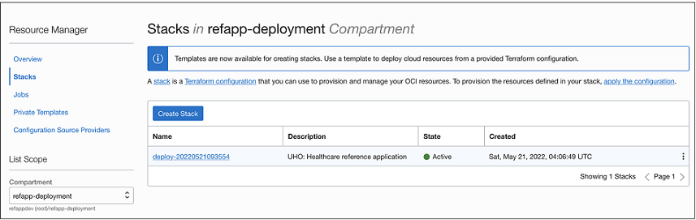

1. The project details page opens. Click **Destroy**.

   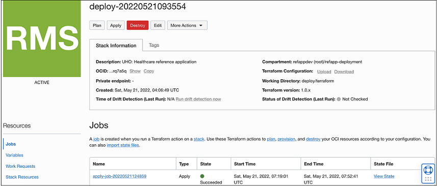

   You can view the job status on the Work Requests page.

   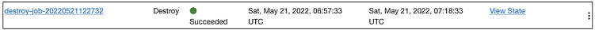

**Note:** Oracle recommends destroying the stack after your usage concluded.
This action ensures that the cloud infrastructure resources used by the app do not continue
to incur usage charges and do not count against the service limits assigned for your tenancy.
