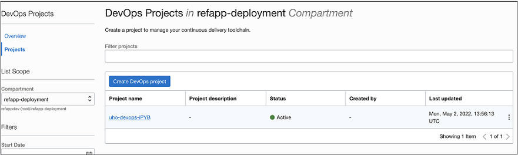
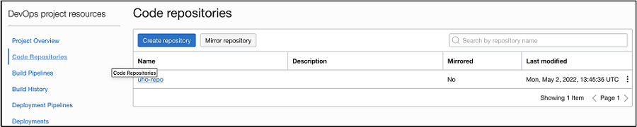
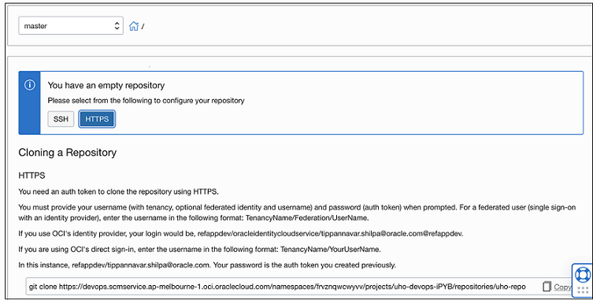
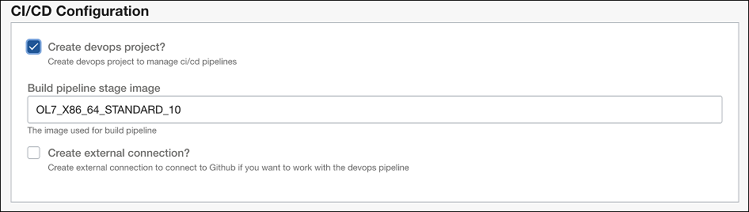
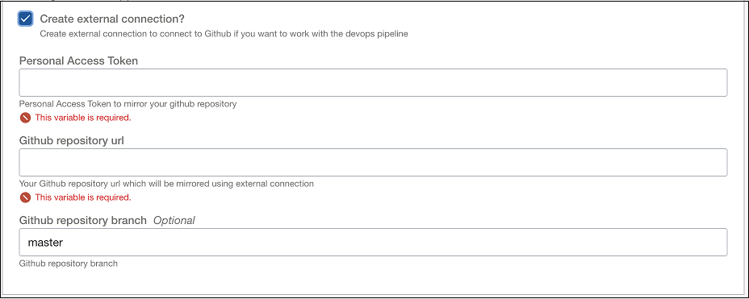
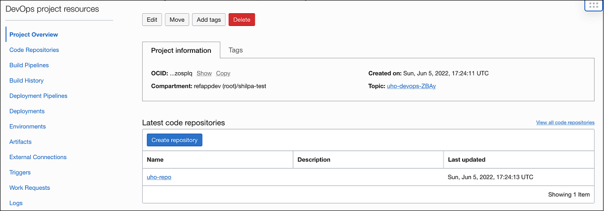
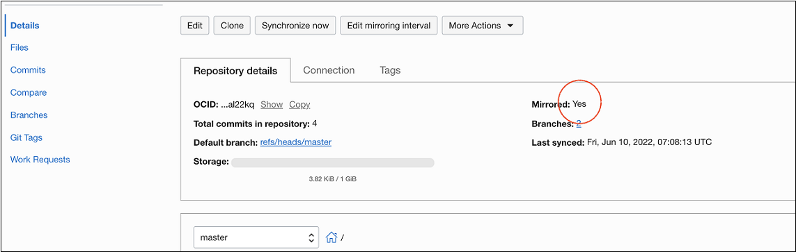

# Deployment through DevOps

The application deployment process elaborated in the [Deployment](deployment.md) section gives the user the option to create a DevOps project.

A DevOps pipeline can automatically rebuild and redeploy containers based on code changes.

Follow these steps for automated redeployments:

1. Open **DevOps Projects** in OCI Console.

   

1. Open the created project and select the **Code Repositories** resource.

   

1. Select the repository. The Repository Details page is displayed.

   

   Copy the repository endpoint.

1. Register your local repository to the DevOps project by adding it as remote repository. For information about the setup, see [Manage Remote Repositories](https://docs.github.com/en/get-started/getting-started-with-git/managing-remote-repositories).
1. The DevOps build pipeline is triggered automatically on code changes.

## Mirroring an external GitHub repository

You can also create a connection to external code repositories such as GitHub. The following section provides the steps to create an external code repository.

### Forking repository and creating Personal Access Token (PAT)

1. Fork the repository.
1. (Optional) Create a branch.
1. Create a PAT. To generate a PAT, see [Generating a GitHub PAT](https://docs.oracle.com/en-us/iaas/Content/devops/using/getting_started.htm#githubpat).

### Mirroring the external GitHub repository with the OCI DevOps code repository

1. Follow the steps for creating a new stack from [Deployment](./deployment.md).

1. Select **Show advanced options**.

   

1. Select **Create DevOps Projects**.

   

1. Select **Create external connection**.

   

1. Enter PAT, GitHub repository, and optional GitHub repository branch.

1. Click **Next**.

1. Review the input, select **Run Apply**, and click **Create**.

1. As part of the apply step, a DevOps project is created.

   

1. Open the `Code Repositories` resource to check if your remote GitHub repository is mirrored.

   

Push any code changes to your remote GitHub branch. After the changes sync with the mirrored repository, a build pipeline is triggered and your changes are deployed automatically.
