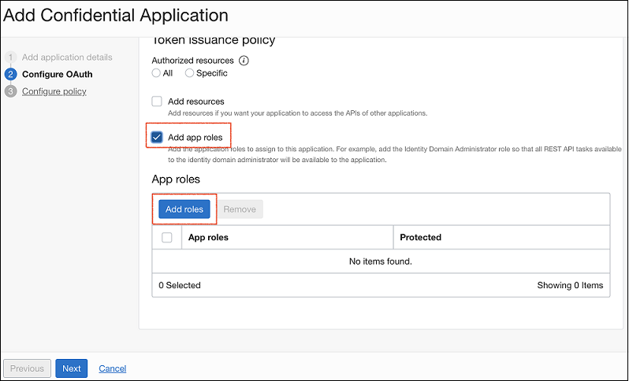
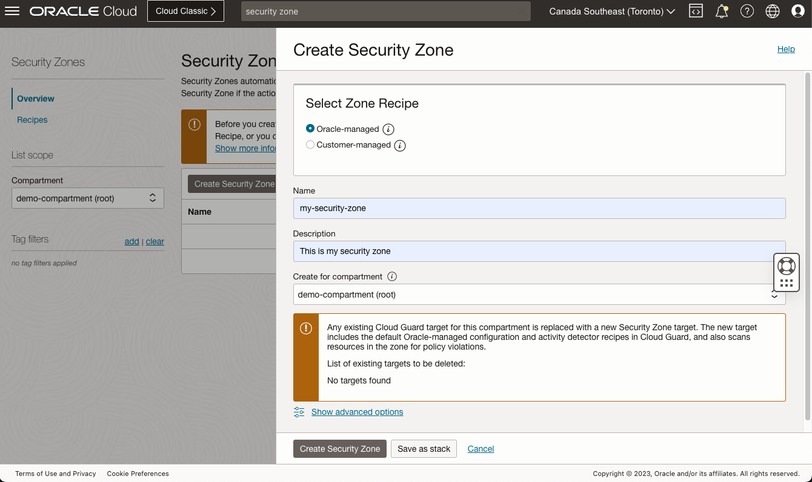

# Prerequisites and Configurations

This section explains the prerequisites and configurations for deploying the UHO Reference Application.

## Service Limits

The following table lists the minimum resource limits for the Oracle Cloud Infrastructure (OCI) services used in the application:

<table class="wrapped confluenceTable"><colgroup><col /><col /><col /></colgroup><tbody><tr><th class="confluenceTh">Service</th><th class="confluenceTh" colspan="1">Resource (Limit Name)</th><th class="confluenceTh">Count</th></tr><tr><td class="confluenceTd">API Gateway</td><td class="confluenceTd" colspan="1">Gateway Count (gateway-count)<br /></td><td class="confluenceTd">1</td></tr><tr><td class="confluenceTd">Application Performance Monitoring (APM)</td><td class="confluenceTd" colspan="1">Maximum number of APM domains per tenant (apm-domain-count)<br /></td><td class="confluenceTd">1</td></tr><tr><td class="confluenceTd">Container Engine for Kubernetes (OKE)</td><td class="confluenceTd" colspan="1">Cluster Count (cluster-count)<br /></td><td class="confluenceTd">1</td></tr><tr><td class="confluenceTd" colspan="1">Database</td><td class="confluenceTd" colspan="1"><br />Autonomous Transaction Processing OCPU Count (atp-ocpu-count)</td><td class="confluenceTd" colspan="1">1</td></tr><tr><td class="confluenceTd" colspan="1">Database</td><td class="confluenceTd" colspan="1"><br />Autonomous Transaction Processing Total Storage (TB) (atp-total-storage-tb)</td><td class="confluenceTd" colspan="1">1</td></tr><tr><td class="confluenceTd" colspan="1">Database</td><td class="confluenceTd" colspan="1"><br />Oracle Autonomous JSON Database OCPU Count (ajd-ocpu-count)</td><td class="confluenceTd" colspan="1">1</td></tr><tr><td class="confluenceTd" colspan="1">Database</td><td class="confluenceTd" colspan="1"><br />Autonomous JSON Database Total Storage in TB (ajd-total-storage-tb)</td><td class="confluenceTd" colspan="1">1</td></tr><tr><td class="confluenceTd" colspan="1">DevOps</td><td class="confluenceTd" colspan="1">Maximum Number of Build Pipelines (build-pipeline-count)</td><td class="confluenceTd" colspan="1">8</td></tr><tr><td class="confluenceTd" colspan="1">DevOps</td><td class="confluenceTd" colspan="1">Maximum Number of Deployment Pipelines (deployment-pipeline-count)</td><td class="confluenceTd" colspan="1">8</td></tr><tr><td class="confluenceTd" colspan="1">DevOps</td><td class="confluenceTd" colspan="1">Maximum Number of Environments (devops-environment-count)</td><td class="confluenceTd" colspan="1">2</td></tr><tr><td class="confluenceTd" colspan="1">DevOps</td><td class="confluenceTd" colspan="1">Maximum Number of Triggers (trigger-count)</td><td class="confluenceTd" colspan="1">8</td></tr><tr><td class="confluenceTd" colspan="1">DevOps</td><td class="confluenceTd" colspan="1">Maximum Number of Deployment Artifacts (devops-artifact-count)</td><td class="confluenceTd" colspan="1">15</td></tr><tr><td class="confluenceTd" colspan="1">DevOps</td><td class="confluenceTd" colspan="1">Maximum Number of DevOps Projects (devops-project-count)</td><td class="confluenceTd" colspan="1">1</td></tr><tr><td class="confluenceTd" colspan="1">Events</td><td class="confluenceTd" colspan="1">Rule count (rule-count)</td><td class="confluenceTd" colspan="1">1</td></tr><tr><td class="confluenceTd" colspan="1">Function</td><td class="confluenceTd" colspan="1">Application count (application-count)</td><td class="confluenceTd" colspan="1">1</td></tr><tr><td class="confluenceTd" colspan="1">Function</td><td class="confluenceTd" colspan="1">Function count (function-count)</td><td class="confluenceTd" colspan="1">1</td></tr><tr><td class="confluenceTd" colspan="1">Key Management</td><td class="confluenceTd" colspan="1"><br />Virtual Vaults per compartment (virtual-vault-count)</td><td class="confluenceTd" colspan="1">1</td></tr><tr><td class="confluenceTd" colspan="1">Logging</td><td class="confluenceTd" colspan="1">Limit for number of log objects that can be created (log-count)</td><td class="confluenceTd" colspan="1">18</td></tr><tr><td class="confluenceTd" colspan="1">Logging</td><td class="confluenceTd" colspan="1">Limit for number of log groups that can be created (log-group-count)</td><td class="confluenceTd" colspan="1">7</td></tr><tr><td class="confluenceTd" colspan="1">Logging</td><td class="confluenceTd" colspan="1">Unified Agent Configuration Count (unified-agent-configuration-count)</td><td class="confluenceTd" colspan="1">1</td></tr><tr><td class="confluenceTd" colspan="1">Notification</td><td class="confluenceTd" colspan="1">Topic count (topic-count)</td><td class="confluenceTd" colspan="1">6</td></tr><tr><td class="confluenceTd" colspan="1">Service Connector Hub</td><td class="confluenceTd" colspan="1"><br />Service Connector Count (service-connector-count)</td><td class="confluenceTd" colspan="1">4</td></tr><tr><td class="confluenceTd" colspan="1">Streaming</td><td class="confluenceTd" colspan="1">Partition Count (partition-count)</td><td class="confluenceTd" colspan="1">5</td></tr><tr><td class="confluenceTd" colspan="1">Virtual Cloud Network</td><td class="confluenceTd" colspan="1"><br /></td><td class="confluenceTd" colspan="1">1</td></tr></tbody></table>

**Note**: The application uses
OCI services such as Container Engine for Kubernetes (OKE), Cloud Guard, Data safe,
and Streaming. These services are not part of [Oracle Cloud Free Tier](https://www.oracle.com/cloud/free/). Therefore, the application cannot be deployed in Oracle Cloud Free Tier.

## Required Policies

The following set of policies are required to deploy the application in your tenancy. If you are a user with an `Administrator` role in the tenancy, you do not need these policies.

1. To allow the user to have admin access to the compartment where the application is deployed, add the following policy:

   ```
   Allow group <user group> to manage all-resources in compartment <compartment name>
   ```

2. To allow the user to query the region, add the following policy:

   ```
   Allow group <user group> to inspect tenancies in tenancy
   ```

3. To allow the user to create dynamic-groups for the cluster, add the following policy:

   ```
   Allow group <user group> to manage dynamic-groups in tenancy
   ```

## Configuration

### IDCS

You can configure Oracle Identity Cloud Service (IDCS) in your application through either Federation or Domains.

#### Configuring IDCS through Federation

If your tenancy uses Federation for IDCS, follow these steps to configure:

1. Open the navigation menu and click **Identity & Security**. Click **Federation**.

   

1. Click **OracleIdentityCloudService**.

   

1. Use the URL (without path parameters) from **Oracle Identity Cloud Service Console** as `IDCS Url` while deploying the application.

1. Click the IDCS url and login to your IDCS instance.

   

1. Under **Applications**, click **Add**.

   

1. Select **Confidential Application**.

   

1. Enter a name for your app and click **Next**.

   

1. Select **Configure this application as a client now**.

1. In **Allowed Grant Types**, select everything except `Authorization Code` and `Implicit`.

   

1. In **App Roles**, add `Identity Domain Administrator`, `Application Administrator`, and `Me`.

   

   

1. Follow the steps in the wizard until you finish the app creation process.

   

   

   

1. Activate your application.

   

   

**Note**: From the Client Configuration tab of this application, note down the `Client ID` and `Client Secret`. You need these details when you deploy the application.

#### Configuring IDCS through Domains

The newer tenancies of OCI have IDCS integrated with the OCI Console and configured through Domains. To configure IDCS through Domains, follow these steps:

1. In your tenancy, open the navigation menu and click **Identity & Security**. Click **Domains**.
   The Domains page opens with a `Default` domain.

   

1. Click the `Default` domain.
   The overview page opens.

   

1. Use the URL from **Domain URL** as `IDCS Url` while deploying the application.
1. From the left navigation pane, click `Applications`.
1. Click **Add application**.

   

1. Select **Confidential Application**, and click **Launch workflow**.

   

   The **Add Confidential Application** page opens.

1. On the **Add application details** page, enter a meaningful name and description and click **Next**.

   

1. Select **Configure this application as a client now**.
   In **Allowed grant types**, select everything except `Authorization code` and `Implicit`.

   

1. Scroll down to **Token Issuance Policy**. Select **Add app roles**.
   Click **Add roles**.

   

1. Select `Identity Domain Administrator`, `Application Administrator`, and `Me`. Click **Next**.

   

1. On the **Configure policy** page, select **Skip and do later**.

   

   Click **Finish**.

1. Activate the application.

   

   

**Note**: From the OAuth configuration page, note down the `Client ID` and `Client Secret`. You need these details when you deploy the application.

### Create a security zone (Optional)

Security Zones enforce security posture on OCI cloud compartments and prevent actions that could weaken a customers’ security posture.

To setup a security zone, follow these steps:

1. Open the navigation menu and click **Identity & Security**. Under **Security Zones**, click **Overview**.
1. Click **Create Security Zone**.
1. Enter a name and description for the security zone. Oracle Cloud creates a compartment with the same name
   and assigns it to this security zone. Avoid entering confidential information.
1. For Create in Compartment, navigate to the compartment where you want to create the security zone.
1. Click **Create Security Zone**.

   
